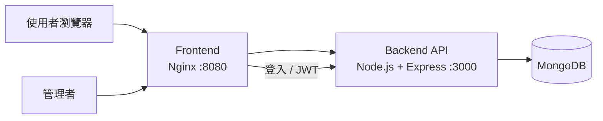

# 電子個人簡介 Portfolio Project

這是一個前後端分離的電子個人簡介網站，使用 Docker Compose 建立執行環境，後端使用 Node.js + Express，資料儲存於 MongoDB，前端使用 HTML、CSS、JavaScript 與 Nginx。

## 專案功能

- 顯示個人基本資料
- 顯示學校與科系
- 顯示個人興趣
- 管理者登入
- JWT 身分驗證
- 管理者可修改個人資料
- 修改後資料儲存至 MongoDB
- 前端與後端分離
- 使用 Docker Compose 管理服務

## 使用技術

### Frontend
- HTML
- CSS
- JavaScript
- Nginx

### Backend
- Node.js
- Express
- Mongoose
- JSON Web Token (JWT)

### Database
- MongoDB

### Deployment
- Ubuntu Server
- Docker
- Docker Compose
- UFW
- SSH Key Authentication

## 系統架構



## 專案結構

```text
portfolio-project/
├── backend/
│   ├── Dockerfile
│   ├── package.json
│   ├── package-lock.json
│   └── server.js
├── frontend/
│   ├── Dockerfile
│   ├── index.html
│   ├── admin.html
│   └── nginx.conf
├── docker-compose.yml
├── .gitignore
└── README.md
```

## 網頁

個人簡介頁：

```text
http://localhost:8080/
```

管理者登入與資料修改頁：

```text
http://localhost:8080/admin.html
```

## API

```text
GET  /api/profile
POST /api/login
PUT  /api/profile
```

其中修改個人資料的 API 需要 JWT 驗證。

## 啟動方式

在專案目錄建立 `.env`，設定管理者帳號、密碼與 JWT Secret。

`.env` 包含敏感資訊，因此已透過 `.gitignore` 排除，不會上傳至 GitHub。

啟動 Docker：

```bash
docker compose up -d --build
```

查看容器狀態：

```bash
docker compose ps
```

## 安全設定

- SSH 使用 Ed25519 金鑰驗證
- SSH 已停用密碼登入
- SSH 禁止 root 登入
- Ubuntu 使用 UFW 防火牆
- 管理者登入後使用 JWT 驗證
- `.env` 不加入 Git 版本控制
- MongoDB 不直接對外公開連接埠

## 作者

jungwon
